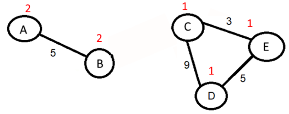
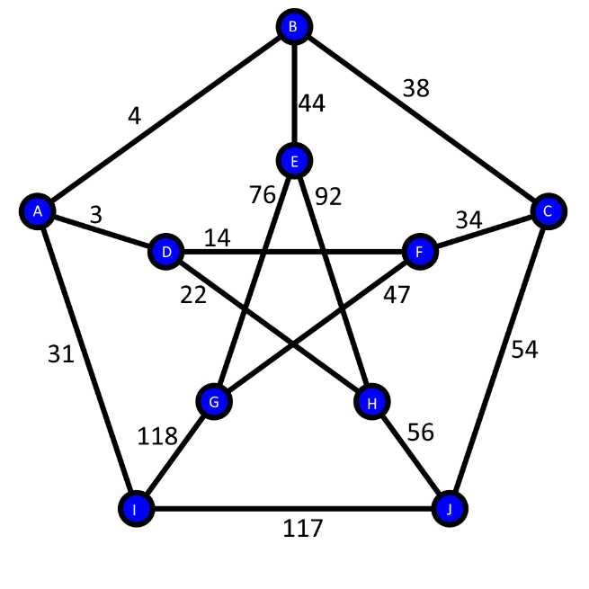

I.  Liste des fonctionnalités et extensions

						

**Graphes et Applications**

Projet – Arbres recouvrant

Année 2020 – 2021

Réalisé par : 						      Responsable de l’UE :

FERCHIOU Iskander			        	      	      M. BONNEVAY Stéphane

OULED MOUSSA Yanis
Page **PAGE2** sur **11**

Sommaire

` `TOC \o "1-3" \h \z \u [I. Choix de langage et structure de graphe	 PAGEREF _Toc73997817 \h 1](#_Toc73997817)

[1.	Langage de programmation	 PAGEREF _Toc73997818 \h 1](#_Toc73997818)

[2.	Structure	 PAGEREF _Toc73997819 \h 1](#_Toc73997819)

[II. Algorithme de Kruskal (version 1)	 PAGEREF _Toc73997820 \h 1](#_Toc73997820)

[1.	Préambule	 PAGEREF _Toc73997821 \h 1](#_Toc73997821)

[2.	Structure de données : union-find	 PAGEREF _Toc73997822 \h 3](#_Toc73997822)

[3.	Déroulement de l’algorithme	 PAGEREF _Toc73997823 \h 3](#_Toc73997823)

[4.	Complexité temporelle	 PAGEREF _Toc73997824 \h 6](#_Toc73997824)

[III. Algorithme de Kruskal (version 2)	 PAGEREF _Toc73997825 \h 6](#_Toc73997825)

[1.	Préambule	 PAGEREF _Toc73997826 \h 6](#_Toc73997826)

[2.	Vérification de la connexité (Partie 1)	 PAGEREF _Toc73997827 \h 6](#_Toc73997827)

[3.	Vérification de la connexité (Partie 2)	 PAGEREF _Toc73997828 \h 6](#_Toc73997828)

[4.	Complexité temporelle	 PAGEREF _Toc73997829 \h 7](#_Toc73997829)

[IV. Algorithme de Prim	 PAGEREF _Toc73997830 \h 7](#_Toc73997830)

[1.	Préambule	 PAGEREF _Toc73997831 \h 7](#_Toc73997831)

[2.	Détection de l’arc du poids minimum	 PAGEREF _Toc73997832 \h 7](#_Toc73997832)

[3.	Complexité temporelle	 PAGEREF _Toc73997833 \h 7](#_Toc73997833)

[V. Tests sur des « petits » graphes	 PAGEREF _Toc73997834 \h 8](#_Toc73997834)

[1.	Préambule	 PAGEREF _Toc73997835 \h 8](#_Toc73997835)

[2.	Algorithme de Kruskal (version 1)	 PAGEREF _Toc73997836 \h 8](#_Toc73997836)

[3.	Algorithme de Kruskal (version 2)	 PAGEREF _Toc73997837 \h 9](#_Toc73997837)

[4.	Algorithme de Prim	 PAGEREF _Toc73997838 \h 9](#_Toc73997838)

[VI. Etude comparative	 PAGEREF _Toc73997839 \h 11](#_Toc73997839)

[1.	Préambule	 PAGEREF _Toc73997840 \h 11](#_Toc73997840)

[2.	Données	 PAGEREF _Toc73997841 \h 11](#_Toc73997841)

[3.	Analyse	 PAGEREF _Toc73997842 \h 11](#_Toc73997842)

[VII. Algorithme d-MST	 PAGEREF _Toc73997843 \h 12](#_Toc73997843)

[1.	Préambule	 PAGEREF _Toc73997844 \h 12](#_Toc73997844)

[2.	Raisonnement	 PAGEREF _Toc73997845 \h 12](#_Toc73997845)

[VIII. Tests de l’algorithme d-MST	 PAGEREF _Toc73997846 \h 12](#_Toc73997846)

[1.	Préambule	 PAGEREF _Toc73997847 \h 12](#_Toc73997847)

[2.	Données et interprétation	 PAGEREF _Toc73997848 \h 13](#_Toc73997848)

[3.	Interprétation	 PAGEREF _Toc73997849 \h 15](#_Toc73997849)

[Annexes	 PAGEREF _Toc73997850 \h 16](#_Toc73997850)

[Bibliographie	 PAGEREF _Toc73997851 \h 16](#_Toc73997851)

I. Choix de langage et structure de graphe
1. ## Langage de programmation
Afin d’implémenter les algorithmes de construction d’arbres recouvrant de poids minimum et de mettre en œuvre un algorithme résolvant le problème d-MST, nous avons, dans un premier temps, décidé d’utiliser le C++ pour découvrir de nouveaux horizons. Cependant, les bibliothèques de ce langage n’étant pas suffisamment garnies, il fallait à chaque étape recoder soi-même les méthodes associées à des structures de données basiques, ou du moins importer des fichiers comportant ces dernières. Compte tenu du nombre de travaux à rendre en cette fin d’année, nous nous sommes finalement orientés vers un langage utilisé à plusieurs reprises durant cette année universitaire, Java, pour optimiser notre temps de travail.
1. ## Structure
Par rapport à notre structure de graphe, notre projet utilise principalement trois classes : Vertex, Edge et Graph. 

- **Vertex** symbolise un sommet qui possède un identifiant, un nom et une liste d’adjacence. 
- **Edge** représente un arc qui comporte une valeur (le poids) et les deux sommets auxquels il est relié.
- **Graph** est la classe dite « principale » où se trouve son nom, son type (orienté ou non), une liste de sommets, une liste d’arcs, une matrice d’adjacence, tous les algorithmes à implémenter avec leur dépendance, la dernière durée d’exécution vis-à-vis d’un algorithme et un lecteur de fichier. D’autres méthodes facilitant l’affichage des résultats ont été également ajoutés ici.
# II. Algorithme de Kruskal (version 1)
1. ## Préambule
Pour cette première version, nous nous sommes appuyés sur la version fournie par notre professeur en cours. Toutefois, la partie de l’algorithme où il faut vérifier l’existence d’un cycle après l’ajout d’une arête a posé quelques problèmes. En effet, nous avons voulu produire par nous-même une fonction hasCycle().

Pour expliquer son fonctionnement, nous nous servirons du graphe suivant :

**Etape 1 : Initialisation**

On initialise le nombre de composantes connexes (CC) à 0 et on crée un dictionnaire dont le sommet est la clé et la CC sa valeur.

**Etape 2 : Boucle principale**

Pour chaque arrête, on vérifie si :

- Le début et la fin de l’arête n’ont pas déjà été parcourus :

*Dans ce cas, on incrémente le nombre de CC puis on les ajoute à la liste des sommets parcourus et on leur donne le même numéro de composante connexe.*

- Sinon, si le début ou la fin de l’arête fait partie d’une CC :

*On ajoute l’arrête dans le dictionnaire en lui attribuant le numéro de la CC correspondante.*

- Sinon, si le début et la fin de l’arête ont déjà été parcourues
  - Si, les deux font parties de la même CC

*Le graphe possède un cycle, on renvoie « True ».*

- Sinon, on lie les deux sous-graphes pour en former un seul

(Dans le cas où l’arrête (C, D) n’existe pas)

Si l’algorithme n’a pas trouvé de cycle durant le processus, on renvoie « False », il n’y a pas de cycle.

Malheureusement, le programme obtenu est en O(m), où m est le nombre d’arcs, donc en intégrant cette méthode dans le code de Kruskal1(), la complexité totale aurait été polynomiale.

1. ## Structure de données : union-find
Après quelques recherches, nous avons appris que l’utilisation de la structure de données union-find permet d’améliorer la vitesse d’exécution et d’obtenir une détection de cycle en O(log(m)). Celle-ci se base principalement sur deux opérations : 

- Find : détermine si deux éléments appartiennent à un même sous-ensemble.
- Union : réunit deux sous-ensembles en un seul sous-ensemble.

Cependant, il existe différentes versions de cette implémentation. Dans notre situation, il est nécessaire d’optimiser la version de base en utilisant la notion de rang pour attacher la racine du sous-ensemble qui contient le moins de sommets à la racine du sous-ensemble qui en contient le plus. De plus, il faut faire de la racine trouvée par la méthode find, le parent du sommet transmis en paramètre à cette fonction pour éviter de parcourir à chaque fois tous les sommets intermédiaires. C’est ce qu’on appelle la compression de chemin.
1. ## Déroulement de l’algorithme
De manière générale, les étapes à suivre sont les suivantes : 

- Trier toutes les arêtes par ordre croissant selon leur poids.
- Parcourir les arêtes triées et vérifier si les deux sommets associés à un arc sont dans le même sous-ensemble.
  - Si c’est le cas, il ne faut pas inclure cet arc dans le graphe à retourner.
  - Si ce n’est pas le cas, il faut l’inclure en réunissant les deux sous-ensembles auxquels appartiennent les deux sommets en question.

Pour expliquer cet algorithme, nous prendrons ce graphe en exemple :

Au départ, aucun sommet n’a de prédécesseurs.

On prend donc l’arête de poids minimum qui est (E, F), aucun des sommets n’a de prédécesseurs, on unit donc les sommets entre eux et on ajoute l’arrête au graphe.

On continue ainsi avec les autres arêtes :

 

Les deux sommets de l’arrête (C, F) ont la même racine et donc, ils font partie du même ensemble, nous n’ajoutons donc pas cette arrête au graphe et nous continuons. 

(C, B) est ajoutée au graphe et l’ensemble de C est uni à l’ensemble de B.

 

Une fois l’arête (A, C) atteinte elle est ajoutée au graphe et l’algorithme ayant atteint tout les sommets s’arrête.

1. ## Complexité temporelle
En appliquant cela à la base apportée par le cours, nous obtenons un code de complexité O(m(log(m)) puisque :

- La méthode de tri de java (Timsort), dérivée du tri fusion et tri par insertion, est en O(m(log(m)).
- L’utilisation des méthodes union-find optimisées (union by rank et path compression) est en O(log(n)).

En prenant en compte la boucle while(|T| < n-1), où T correspond à l’arbre recouvrant de poids minimum à retourner et n au nombre de sommets, on obtient une complexité temporelle globale de O(m(log(m)) + m(log(n))). Sachant que (log(m)) = O(log(n)) puisque m = O(n²), on aboutit bien finalement à une complexité de O(m(log(m))).
# III. Algorithme de Kruskal (version 2)
1. ## Préambule
`	`Concernant la deuxième version de l’algorithme de Kruskal, nous nous sommes également inspirés de la version disponible dans le cours. 

Ici, la difficulté principale était d’implémenter un algorithme de détection de connexité du graphe. Pour cela, nous avons tenté d’appliquer les méthodes utilisées auparavant avec la structure de données union-find, sans succès… Après maintes recherches sur internet, nous n’avons trouvé aucun moyen d’atteindre une complexité temporelle en O(m(log(m))) comme il est écrit dans le cours. La méthode classique semble être l’utilisation d’un algorithme de parcours en profondeur en déterminant si tous les sommets sont atteignables en commençant par la racine. Néanmoins, cette manière de procéder débouche sur une complexité en temps linéaire donc nous avons pris la décision d’accorder moins d’attention à l’impact de cette notion dans le cadre de l’élaboration de la deuxième version de Kruskal.
1. ## Vérification de la connexité (Partie 1)

Dans un premier temps, nous nous sommes rabattus sur une méthode simple qui consiste à attribuer à chaque sommet un numéro de composante connexe (sous-graphe) différent, puis l’algorithme parcourt chaque sommet en ajoutant tous ses sommets adjacents à la même composante connexe. Une fois chaque sommet assimilé à la bonne composante connexe, il suffit de vérifier que chaque sommet se trouve dans la même composante connexe pour savoir si le graphe est connexe ou non.
1. ## Vérification de la connexité (Partie 2)
Néanmoins, la façon de faire, énoncée auparavant, est loin d’être optimisé et nous avons rapidement remarqué que l’exécution de l’algorithme prenait beaucoup plus de temps qu’il n’en fallait sur des graphes contenant une multitude de sommets et d’arcs. De ce fait, nous avons pris la décision de s’appuyer sur le DFS (Depth-first search). Il est important de savoir que cette approche n’est pas optimale et conduit à une implémentation dite « naïve » de la deuxième version de Kruskal mais n’ayant pas réussi à trouver une meilleure idée, nous nous sommes contentés de cette méthode.

Dans l’optique d’atteindre l’objectif souhaité, nous avons intégré une fonction booléenne isConnected() qui utilise le DFS, procédure récursive, pour effectuer un parcours en profondeur de l’arbre et vérifier si tous les sommets sont atteignables par n’importe quel autre nœud grâce à la liste d’adjacence de chaque vertex. Par ailleurs, les sommets visités sont stockés dans une liste de sommets afin de vérifier, plus tard, si un nœud est contenu ou non dans cette liste et d’en déduire la connexité de l’arbre.
1. ## Complexité temporelle
Concernant la complexité temporelle, cet algorithme est en O(m²). Etant donné que le Timsort est en O(m(log(m))), la boucle while(|T| ≥ n) en O(m) et le DFS en O(m+n), le calcul est le suivant :

Omlogm +m\*m+n=O(m2)

En comparant à la première version de Kruskal, le temps d’exécution dans le pire des cas est nettement moins satisfaisant. 
# IV. Algorithme de Prim
1. ## Préambule
Par rapport aux algorithmes précédents, celui-ci a surement été le plus intuitif en matière d’implémentation car il n’y a pas eu besoin de savoir comment détecter un cycle ou déterminer la connexité d’un graphe. 
1. ## Détection de l’arc du poids minimum
Pour parvenir à un bon rendu, il suffisait de suivre l’algorithme donné en cours et de réfléchir à la manière de prendre l’arête (y, z) de poids minimum tel que y∈R et z∈X-R où X est le graphe de base et R la liste des sommets visités. Bien entendu, la contrainte principale était de trouver cet arc en temps linéaire. Ainsi, nous avons décidé de :

- Parcourir chaque arête du graphe choisi
- Vérifier si celle-ci est de poids minimum
- Regarder si y∈R et z∈X-R mais aussi si z∈R et y∈X-R
  - Si c’est le cas, on retient l’arête, son poids et le sommet appartenant à 
    X-R.
  - Si ce n’est pas le cas, on ne retient rien du tout.
- A la sortie de la boucle, on ajoute le sommet retenu dans la liste des sommets visités et l’arrête de poids minimum dans le graphe qui sera renvoyé par l’algorithme.
1. ## Complexité temporelle
Etant donné que les étapes énoncées ci-dessus aboutissent à une complexité temporelle en O(n), la complexité globale de l’algorithme de Prim se fait en O(n²).
# V. Tests sur des « petits » graphes
1. ## Préambule
Avant d’aborder cette partie, il est judicieux d’informer le lecteur de la manière dont nous avons intégré les petits graphes de test. Au lieu de construire directement le graphe dans le code, nous nous sommes inspirés du format contenu dans les fichiers «.gsb » fournis par M. Bonnevay pour créer de nouveaux fichiers de tests. Cette façon de faire possède l’avantage de réutiliser la lecture de fichier codée dans la classe Graph mais également l’inconvénient de faire perdre du temps lorsque le nombre de sommets et d’arrêtes devient considérable. Pour la suite, il faut savoir que nos algorithmes ont été testé sur plusieurs graphes mais seuls quelques tests seront exposés ici afin de ne pas surcharger ce rapport inutilement.
1. ## Algorithme de Kruskal (version 1)
Afin de vérifier le bon fonctionnement de nos algorithmes, nous avons utilisé trois graphes simples. Le premier (petitGraph.gsb) a été pris de la page Wikipédia de l’algorithme de Kruskal car il est possible de comparer l’arbre recouvrant obtenu à celui généré par notre code.

                              

En executant notre première version de l’algorithme de Kruskal sur ce graphe, on obtient bien le bon arbre recouvrant de poids minimum :

       
1. ## Algorithme de Kruskal (version 2)
Cependant, même si ce graphe est un bon exemple pour commencer, il n’est pas évident de se représenter sans support visuel la connexité après avoir retiré plusieurs arêtes donc nous avons imaginé et construit un graphe (connexe.gsb) avec moins de sommets et moins d’arcs qui permettra de voir assez rapidement si la deuxième version de l’algorithme de Kruskal aboutit à un résultat cohérent.

En dehors de l’arête (E, D), si un seul arc est retiré, alors ce n’est plus un arbre recouvrant. Voici l’issue de l’exécution :

                    

1. ## Algorithme de Prim
Enfin, pour mettre à l’épreuve la solidité de notre code, nous avons exposé nos algorithmes au graphe de Petersen. Celui-ci est connu pour servir d’exemple et de contre-exemple pour plusieurs problèmes de la théorie des graphes. En effet, de nombreuses prédictions optimistes sur ce qui devait être vrai pour tous les graphes ont été balayé par ce petit graphe régulier de degré 3.

        

Par exemple, voici ce que retourne notre IDE en exécutant l’algorithme de Prim sur le graphe ci-dessus :

 

# VI. Etude comparative
1. ## Préambule
Dans l’optique de comparer les différents algorithmes implémentés en termes de temps de calculs et de qualité de résultats, nous avons mis en place une fonction qui permet de lire chaque graphe contenu dans le dossier « Graphs » du projet. Pour chaque fichier, les trois algorithmes sont exécutés et leur durée d’exécution, en ms, est affiché à l’écran.
1. ## Données
Nos algorithmes nous ont permis de récolter les données suivantes concernant leur exécution :

|**Fichier**|**Nb Sommets**|**Nb Arcs**|**Kruskal 1**|**Kruskal 2**|**Prim**|**Poids  final**|
| :-: | :-: | :-: | :-: | :-: | :-: | :-: |
|connexe.gsb|5|5|1,4848 ms|0,6786 ms|0,524 ms|28|
|crd1000.gsb|100|4950|21,2899 ms|4528,09 ms|28,2331 ms|6154|
|crd300.gsb|30|435|0,4404 ms|14,536 ms|0,5637 ms|3624|
|crd500.gsb|50|1225|1,1861 ms|162,235 ms|1,3751 ms|4910|
|crd700.gsb|70|2415|2,2871 ms|789,171 ms|3,8579 ms|5761|
|peterson.gsb|10|15|0,0348 ms|0,1255 ms|0,0095 ms|253|
|petitGraph.gsb|7|11|0,0305 ms|0,0278 ms|0,0057 ms|39|
|shrd150.gsb|15|105|0,08 ms|0,4991 ms|0,0186 ms|164|
|shrd200.gsb|20|190|0,1513 ms|2,1146 ms|0,0392 ms|157|
|shrd300.gsb|30|435|0,3897 ms|15,2793 ms|0,1034 ms|274|
|str1000.gsb|100|4950|5,529 ms|4436,78 ms|10,7119 ms|4261|
|str300.gsb|30|435|0,2754 ms|13,3206 ms|0,3028 ms|3457|
|str500.gsb|50|1225|0,9994 ms|155,934 ms|1,5359 ms|3659|
|str700.gsb|70|2415|1,4524 ms|753,187 ms|3,8391 ms|3956|
|sym300.gsb|30|435|0,2013 ms|16,9521 ms|0,1682 ms|958|
|sym500.gsb|50|1225|0,6088 ms|163,834 ms|1,1657 ms|1098|
|sym700.gsb|70|2415|1,2915 ms|781,795 ms|4,295 ms|1177|
1. ## Analyse
A première vue, il semblerait que la deuxième version de l’algorithme de Kruskal soit la plus lente de manière générale. Par rapport à tout ce qui a été dit précédemment et notamment vis-à-vis de la complexité temporelle engendrée par l’utilisation du DFS, cela n’est pas vraiment une surprise. 

En ce qui concerne les deux autres algorithmes, les nombres parlent d’eux-mêmes : ils sont bien plus rapides. Cependant, Prim semble être capable de prendre le dessus sur des petits graphes comme shrd150 tandis que la première version de Kruskal est meilleure lorsqu’il s’agit de graphes comportant énormément d’arêtes et de sommets tels que crd1000. Il est possible de justifier cela par les méthodes sur lesquelles s’appuient les deux codes. En effet, dans le pire des cas, la recherche de l’arc de poids minimum s’effectue en O(n) et la détection d’un cycle en s’appuyant sur la structure de données union-find en O(log(m)).

Pour finir, ces fichiers de tests possèdent certainement des particularités qui les différencient les uns des autres mais nous n’avons pas connaissances de ces éléments donc il est envisageable que d’autres paramètres comme la disposition du graphe influent sur le temps d’exécution des algorithmes. 
# VII. Algorithme d-MST
1. ## Préambule
Afin de respecter la contrainte de degré maximum à ne pas dépasser, nous avons décidé, arbitrairement, de prendre l’algorithme de Prim comme base. Notre choix aurait très bien pu se porter sur l’une des deux versions de l’algorithme de Kruskal. Cependant, l’idée de vérifier, après l’ajout d’un nouvel arc, que le degré des deux sommets associés à celui-ci ne devient pas supérieur au degré souhaité est bien plus intuitive. 
1. ## Raisonnement
La première étape se résume à mettre en place une liste temporaire d’arcs pour stocker les arêtes de poids minimum qui ne répondent pas à la condition voulue. Cela évite notamment d’entrer dans une boucle infinie ou de modifier le graphe de base en supprimant des arcs. Ensuite, il est nécessaire de prendre en compte la modification des listes d’adjacences des deux sommets associés à l’arête de poids minimum lors de l’ajout ou le retrait de celle-ci dans l’arbre résultant. Dès lors, il ne reste plus qu’à procéder à quelques modifications dans l’algorithme de Prim :

- En plus des sommets z∈X-R et y∈X-R, on sauvegardera également les nœuds z∈R et y∈R lors de la recherche de l’arête (y, z) de poids minimum.

- Après l’ajout de l’arête de poids minimum dans l’arbre résultant, il faut vérifier si les sommets enregistrés auparavant ont un degré supérieur à celui passé en paramètre pour que l’arc ajouté respecte la contrainte de degré maximum.

- Si cette dernière n’est pas respectée, il est primordial de retirer l’arc de poids minimum trouvé du MST et la stocker dans la liste temporaire définie précédemment. 

- Dans le cas de figure où l’ajout n’a pas provoqué de problème particulier, il faut simplement ajouter le sommet retenu lors de la recherche de l’arête de poids minimum dans la liste des nœuds visités. 
# VIII. Tests de l’algorithme d-MST
1. ## Préambule
Pour vérifier que l’algorithme détaillé précédemment s’exécute sans accrocs, nous allons comparer le poids obtenu à la sortie de l’algorithme de Prim à celui du 
d-MST sur plusieurs valeurs de d : 2, 3, 4 et 5. De cette manière, on arrivera également à connaître le degré à partir duquel les résultats obtenus sont satisfaisants pour les graphes fournis par notre enseignant.
1. ## Données et interprétation
Nous avons pu obtenir les résultats suivants, générés par notre programme dans un format .csv, à partir des algorithmes d-MST et Prim :

**Degré 2 :**

|**Fichier**|**Prim**|**2-MST**|**Poids  Prim**|**Poids  d-MST**|**Rapport**|
| :-: | :-: | :-: | :-: | :-: | :-: |
|crd1000.gsb|37,7253 ms|548,0241 ms|6154|8450|1,3731|
|crd300.gsb|0,4542 ms|8,9593 ms|3624|4464|1,2318|
|crd500.gsb|1,862 ms|23,3734 ms|4910|6089|1,2401|
|crd700.gsb|3,9009 ms|219,0862 ms|5761|7652|1,3282|
|peterson.gsb|0,0087 ms|0,1039 ms|253|403|1,5929|
|petitGraph.gsb|0,0061 ms|0,4814 ms|39|41|1,0513|
|shrd150.gsb|0,025 ms|0,6376 ms|164|1196|7,2927|
|shrd200.gsb|0,0546 ms|2,7972 ms|157|2350|14,9682|
|shrd300.gsb|0,1134 ms|41,4953 ms|274|6101|22,2664|
|str1000.gsb|11,0197 ms|2786,9082 ms|4261|5268|1,2363|
|str300.gsb|0,1838 ms|4,108 ms|3457|4332|1,2531|
|str500.gsb|1,4448 ms|60,0599 ms|3659|4509|1,2323|
|str700.gsb|4,0451 ms|167,4694 ms|3956|4844|1,2245|
|sym300.gsb|0,1386 ms|0,8991 ms|958|2187|2,2829|
|sym500.gsb|1,1081 ms|13,3549 ms|1098|3122|2,8434|
|sym700.gsb|3,322 ms|175,8263 ms|1177|3572|3,0348|

**Degré 3 :**

|**Fichier**|**Prim**|**3-MST**|**Poids  Prim**|**Poids  d-MST**|**Rapport**|
| :-: | :-: | :-: | :-: | :-: | :-: |
|crd1000.gsb|13,7973 ms|14,6713 ms|6154|6155|1,0002|
|crd300.gsb|0,6878 ms|0,8116 ms|3624|3624|1,0000|
|crd500.gsb|1,529 ms|2,9439 ms|4910|4910|1,0000|
|crd700.gsb|4,0695 ms|4,7003 ms|5761|5761|1,0000|
|peterson.gsb|0,0068 ms|0,035 ms|253|253|1,0000|
|petitGraph.gsb|0,0174 ms|0,0197 ms|39|39|1,0000|
|shrd150.gsb|0,0203 ms|0,2098 ms|164|747|4,5549|
|shrd200.gsb|0,0445 ms|0,8305 ms|157|1246|7,9363|
|shrd300.gsb|0,1033 ms|6,5063 ms|274|3147|11,4854|
|str1000.gsb|10,3361 ms|34,548 ms|4261|4765|1,1183|
|str300.gsb|0,2085 ms|0,3198 ms|3457|3969|1,1481|
|str500.gsb|1,2915 ms|3,9673 ms|3659|4162|1,1375|
|str700.gsb|3,7559 ms|9,1635 ms|3956|4455|1,1261|
|sym300.gsb|0,1802 ms|0,2429 ms|958|1023|1,0678|
|sym500.gsb|1,5141 ms|2,1872 ms|1098|1181|1,0756|
|sym700.gsb|4,083 ms|5,025 ms|1177|1492|1,2676|

**Degré 4 :**

|**Fichier**|**Prim**|**4-MST**|**Poids  Prim**|**Poids  d-MST**|**Rapport**|
| :-: | :-: | :-: | :-: | :-: | :-: |
|crd1000.gsb|14,319 ms|14,8417 ms|6154|6154|1,0000|
|crd300.gsb|0,5665 ms|0,539 ms|3624|3624|1,0000|
|crd500.gsb|1,4346 ms|1,561 ms|4910|4910|1,0000|
|crd700.gsb|5,2887 ms|4,4584 ms|5761|5761|1,0000|
|peterson.gsb|0,0067 ms|0,0377 ms|253|253|1,0000|
|petitGraph.gsb|0,0091 ms|0,026 ms|39|39|1,0000|
|shrd150.gsb|0,0182 ms|0,2618 ms|164|517|3,1524|
|shrd200.gsb|0,0442 ms|0,4955 ms|157|903|5,7516|
|shrd300.gsb|0,1983 ms|3,1822 ms|274|2161|7,8869|
|str1000.gsb|13,9406 ms|24,4775 ms|4261|4546|1,0669|
|str300.gsb|0,1855 ms|0,3307 ms|3457|3776|1,0923|
|str500.gsb|2,0544 ms|3,5213 ms|3659|3962|1,0828|
|str700.gsb|3,5742 ms|6,7858 ms|3956|4249|1,0741|
|sym300.gsb|0,1301 ms|0,1696 ms|958|965|1,0073|
|sym500.gsb|0,9629 ms|1,5113 ms|1098|1119|1,0191|
|sym700.gsb|3,1046 ms|3,7452 ms|1177|1344|1,1419|

**Degré 5 :**

|**Fichier**|**Prim**|**5-MST**|**Poids  Prim**|**Poids  d-MST**|**Rapport**|
| :-: | :-: | :-: | :-: | :-: | :-: |
|crd1000.gsb|12,0555 ms|17,5299 ms|6154|6154|1,0000|
|crd300.gsb|0,5222 ms|0,6706 ms|3624|3624|1,0000|
|crd500.gsb|1,239 ms|1,4603 ms|4910|4910|1,0000|
|crd700.gsb|4,4615 ms|4,333 ms|5761|5761|1,0000|
|peterson.gsb|0,0089 ms|0,0346 ms|253|253|1,0000|
|petitGraph.gsb|0,0086 ms|0,0142 ms|39|39|1,0000|
|shrd150.gsb|0,0224 ms|0,2559 ms|164|375|2,2866|
|shrd200.gsb|0,0379 ms|0,6532 ms|157|687|4,3758|
|shrd300.gsb|0,0913 ms|1,9162 ms|274|1625|5,9307|
|str1000.gsb|10,4443 ms|19,6393 ms|4261|4403|1,0333|
|str300.gsb|0,2261 ms|0,2765 ms|3457|3613|1,0451|
|str500.gsb|1,4111 ms|2,5549 ms|3659|3807|1,0404|
|str700.gsb|3,5305 ms|5,6858 ms|3956|4100|1,0364|
|sym300.gsb|0,4148 ms|0,2143 ms|958|964|1,0063|
|sym500.gsb|1,221 ms|1,2614 ms|1098|1104|1,0055|
|sym700.gsb|4,9246 ms|3,5716 ms|1177|1205|1,0238|

1. ## Interprétation
Avant d’entamer cette partie, il est nécessaire de rappeler la signification du rapport « Poids de l’arbre d-MST » sur « Poids de l’arbre MST » :

- Si le rapport est considérablement supérieur à 1, cela veut dire que le poids de l’arbre 
  d-MST est plus grand que celui obtenu par l’algorithme de Prim et donc qu’il est moins optimal pour le degré choisi.

- Si le rapport est égal à 1, il est évident que les poids retournés sont égaux et qu’augmenter le degré n’aboutira pas à un meilleur poids que celui retourné par l’algorithme de Prim.

- Si le rapport tourne autour de 1, on considèrera que les poids sont très proches mais qu’il est encore possible d’améliorer celui-ci.

Pour un degré égal à 2, on remarque assez rapidement que les fichiers de type « shrd.gsb » sont les mauvais élèves. En effet, notre algorithme d-MST renvoie un poids minimum environ 7 fois supérieur à celui obtenu par Prim pour « shrd150 ». Concernant les fichiers « sym.gsb » c’est déjà mieux mais pas assez optimal. Par rapport au reste, toutes les valeurs fluctuent autour de 1 mais aucune n’est égale à 1.

Pour un degré égal à 3, on constate cette fois-ci que l’algorithme d-MST retourne, vis-à-vis des graphes « sym.gsb », un poids minimum qui se rapproche de celui retourné par Prim. De plus, quelques fichiers ont atteint la valeur de 1, ce qui signifie qu’il n’est pas possible d’obtenir un poids minimum encore plus optimisé avec un degré supérieur. Néanmoins, le poids minimum des graphes « shrd.gsb » n’est pas encore maximal même s’il y a du mieux.

Pour un degré égal à 4 ou 5, on observe que les valeurs qui fluctuaient autour de 1 sont encore plus proche de cette valeur et que le poids minimum des fichiers « shrd.gsb » est encore plus faible.

En ce qui concerne le temps d’exécution de l’algorithme d-MST et Prim, on voit que par exemple, le graphe « str1000.gsb » pour d = 2 met environ 2786,9082 ms à trouver l’arbre recouvrant de poids minimum respectant cette contrainte mais seulement 34,548 ms avec 
d = 3 donc il a mis environ 80 fois moins de temps à trouver le bon résultat en incrémentant seulement la valeur du degré. Il est possible d’expliquer cela par le fait que lorsque l’arête de poids minimum a été trouvée, si celle-ci ne respecte pas la contrainte du degré imposée, elle est rejetée et donc il faut en chercher une autre, ce qui dans le pire des cas débouche à une complexité temporelle de On3. 

En guise de conclusion, on peut affirmer que :

- Plus le degré est élevé, et plus le poids minimum renvoyé par le d-MST est proche de celui trouvé par Prim. Réciproquement, plus le degré est faible, et plus le poids minimum renvoyé par d-MST s’éloigne de celui trouvé par Prim.

- Plus le degré est bas, plus le d-MST met du temps à trouver les bons arcs en raison des conditions supplémentaires qui ont été ajoutés dans le code par rapport à Prim.

# Annexes
## Bibliographie
**Kruskal (version 1)**

<https://en.wikipedia.org/wiki/Kruskal%27s_algorithm>

<https://fr.wikipedia.org/wiki/Union-find> 

<https://labuladong.gitbook.io/algo-en/iv.-high-frequency-interview-problem/union-find-explanation> 

<https://opendsa-server.cs.vt.edu/ODSA/Books/CS3/html/Kruskal.html>

**Kruskal (version 2)**

<https://en.wikipedia.org/wiki/Reverse-delete_algorithm>

<https://fr.wikipedia.org/wiki/Algorithme_de_parcours_en_profondeur>

**Prim**

<https://en.wikipedia.org/wiki/Prim%27s_algorithm> 

**D-MST**

<https://hal.archives-ouvertes.fr/lirmm-00907052>

<https://en.wikipedia.org/wiki/Degree-constrained_spanning_tree>

**Graphe de Petersen**

<https://fr.wikipedia.org/wiki/Graphe_de_Petersen> 
3A InformatiquePage **PAGE  \\* Arabic  \\* MERGEFORMAT3** sur **16**Projet
